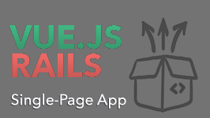

```
Roberto Nogueira  
BSd EE, MSd CE
Solution Integrator Experienced - Certified by Ericsson
```
# Pragmatic Studio - Vue.js Rails



**About**

Learn everything you need to about the subject of this `Pragmatic Studio` project.

[Homepage](https://online.pragmaticstudio.com/courses/unpacked-fishub/steps/1)

## Topics

* [x] [01. Intro and Setup](https://online.pragmaticstudio.com/courses/unpacked-fishub/steps/2)
* [x] [02. App and Design Overview](https://online.pragmaticstudio.com/courses/unpacked-fishub/steps/5)
* [x] [03. Vue App Overview](https://online.pragmaticstudio.com/courses/unpacked-fishub/steps/7)
* [ ] [04. Rails App Overview]()
* [ ] [05. End-to-End: Fetch Baits]()
* [ ] [06. Vuex]()
* [ ] [07. End-to-End: Fetch Tackle Box]()
* [ ] [08. End-to-End: Add Tackle Box Item]()
* [ ] [09. Render the Tackle Box]()
* [ ] [10. End-to-End: Create a Catch]()
* [ ] [11. Authentication]()
* [ ] [12. End-to-End: Sign In]()
* [ ] [13. Authenticated Requests]()

